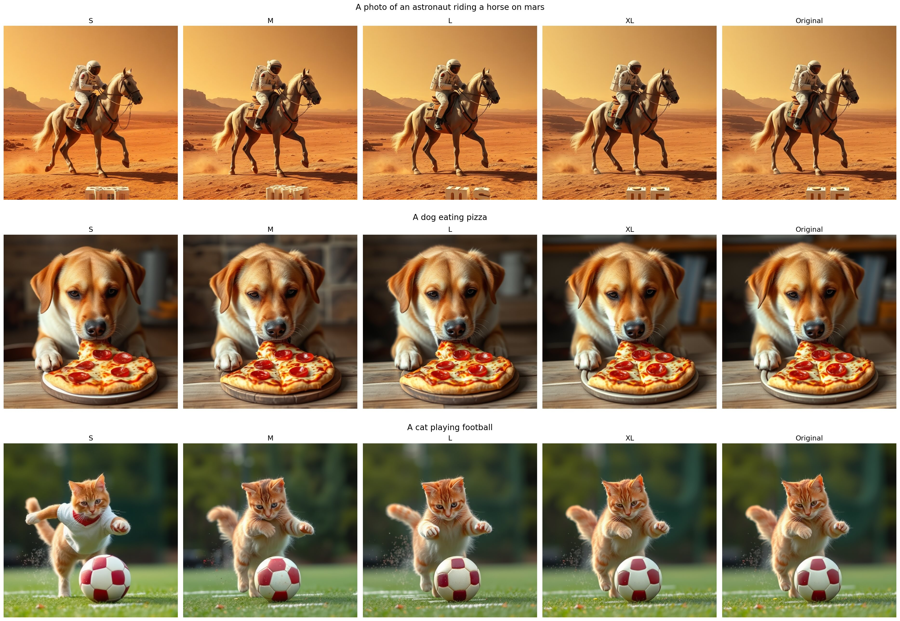

<div align="center" id="sglangtop">
</img>
</div>

--------------------------------------------------------------------------------

| [**Hugging Face**]()
| [**TheStage AI Platform**](https://app.thestage.ai/)
| [**TheStage AI Website**](https://about.thestage.ai/)
| [**TheStage AI X**](https://https://x.com/TheStageAI)

---
# Elastic Models: Fast and Flexible Models for Self-Serving
Elastic models are the models produced by TheStage AI ANNA: Automated Neural Networks Accelerator. ANNA allows you to control model size, latency and quality with a simple slider movement. Elastic models:

* Represented by 4 tiers: S, M, L, XL. From fastest to slowest.

* __XL__: Mathematically equivalent neural network, optimized with our DNN compiler. 

* __L__: Near lossless model, with less than 1% degradation obtained on corresponding benchmarks.

* __M__: Faster model, with accuracy degradation less than 1.5%.

* __S__: The fastest model, with accuracy degradation less than 2%.

* Supports LLMs, VLMs, Diffusion models. All models provided in Hugging Face transformers and diffusers libraries. 

* Underlying inference engine supports fp16, bf16, int8, fp8, int4, 2:4 sparsity inference. To control quality of models we are using ANNA: Automated NNs Analyzer. For each point corresponding to number of bitops or model size ANNA finds the best quality solution using supported hardware acceleration techniques. Think of it like JPEG for DNNs.

* No dependecies with TensorRT-LLM, Sglang, vLLM. Simple setup through PyPi. 


### Goals

* Provide flexibility in cost vs quality selection for inference
* Provide clear quality and latency benchmarks
* Provide interface of HF libraries: transformers and diffusers with a single line of code
* Provide models supported on a wide range of hardware, which are pre-compiled and require no JIT.
* Provide the best models and service for self-hosting.
---



## Quick Start

__System requirements:__
* GPUs: B200 (diffusion), RTX 5090 (diffusion) H100, L40s 
* CPU: AMD, Intel
* Python: 3.10-3.12


To work with our models just run these lines in your terminal:

```shell
pip install thestage
pip install elastic_models[nvidia]\
 --index-url https://thestage.jfrog.io/artifactory/api/pypi/pypi-thestage-ai-production/simple\
 --extra-index-url https://pypi.nvidia.com\
 --extra-index-url https://pypi.org/simple
pip install flash_attn==2.7.3 --no-build-isolation
pip uninstall apex
```

Then go to [app.thestage.ai](https://app.thestage.ai), login and generate API token from your profile page. Set up API token as follows:

```shell
thestage config set --api-token <YOUR_API_TOKEN>
```

Congrats, now you can use accelerated models!

```python
import torch
from transformers import AutoTokenizer
from elastic_models.transformers import AutoModelForCausalLM

# Currently we require to have your HF token
# as we use original weights for part of layers and
# model confugaration as well
model_name = "meta-llama/Meta-Llama-3.1-8B-Instruct"
hf_token = ''
device = torch.device("cuda")

# Create mode
tokenizer = AutoTokenizer.from_pretrained(
    model_name, token=hf_token
)
model = AutoModelForCausalLM.from_pretrained(
    model_name, 
    token=hf_token,
    torch_dtype=torch.bfloat16,
    attn_implementation="sdpa",
    mode='S'
).to(device)
model.generation_config.pad_token_id = tokenizer.eos_token_id

# Inference simple as transformers library
prompt = "Describe basics of DNNs quantization."
messages = [
  {
    "role": "system",
    "content": "You are a search bot, answer on user text queries."
  },
  {
    "role": "user",
    "content": prompt
  }
]

chat_prompt = tokenizer.apply_chat_template(
    messages, add_generation_prompt=True, tokenize=False
)

inputs = tokenizer(chat_prompt, return_tensors="pt")
inputs.to(device)

with torch.inference_mode():
    generate_ids = model.generate(**inputs, max_length=500)

input_len = inputs['input_ids'].shape[1]
generate_ids = generate_ids[:, input_len:]
output = tokenizer.batch_decode(
    generate_ids,
    skip_special_tokens=True, 
    clean_up_tokenization_spaces=False
)[0]

# Validate answer
print(f"# Q:\n{prompt}\n")
print(f"# A:\n{output}\n")

```

## Current state

- **Hardware.** Nvidia H100, L40s. More GPUs are coming.
- **LLMs.** Llama3 1B, 8B instruct, Mistral 7B instruct, Qwen2.5 7B instruct, Deepseek R1: Llama 8B distill, Qwen2.5 7B distill. 
- **Text-to-Image.** FLUX.1-schnell, FLUX.1-dev.
- **VLMs.** Coming soon!
- **Context length.** Demo models support context lenght up to 8192 tokens and batch size up to 32 depending on GPU.
- **Image sizes.** Diffusion models currently supports image resolution up to 1280x1280.
- **Memory usage.** Currently inference engine preallocates memory for maximum possible size. For more precise memory control - contact us at contact@thestage.ai
- **Speed.** Models demonstrates world leading performance comparing to open benchmarks. For instnace, LLama3 8B gives ~195 tok/s with 100/300 input-output test and ~170 tok/s with 4096/1000 input-output test on H100. For each model we are providing benchmarks.

## Roadmap

- Add support for A100, A10g, RTX 4090
- Models serving.
- VLMs.
- Text-to-video models.
- Edge devices inference.


## Contact Us

For companies interested in deploying TheStage AI inference engine in their environment, application of ANNA for custom models or partnership please contact us at contact@thestage.ai.
