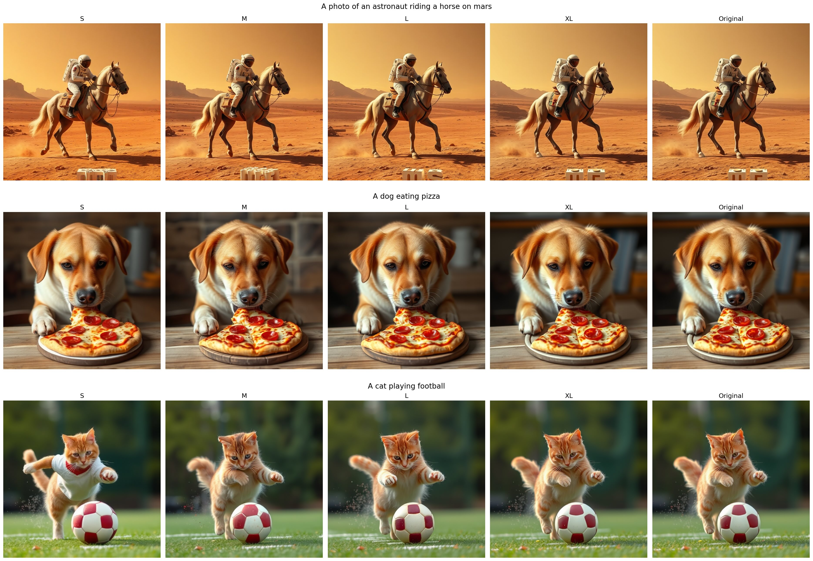

<div align="center" id="sglangtop">
</img>
</div>

--------------------------------------------------------------------------------

| [**Hugging Face**](https://huggingface.co/TheStageAI)
| [**TheStage AI Platform**](https://thestage.ai/)
| [**TheStage AI Docs**](https://app.thestage.ai/docs)
| [**TheStage AI Website**](https://about.thestage.ai/)
| [**TheStage AI X**](https://x.com/TheStageAI)

---
# Elastic Models: Fast and Flexible Models for Self-Serving
Elastic models are the models produced by TheStage AI ANNA: Automated Neural Networks Accelerator. ANNA allows you to control model size, latency and quality with a simple slider movement. Elastic models:

* Represented by 4 tiers: S, M, L, XL. From fastest to slowest.

* __XL__: Mathematically equivalent neural network, optimized with our DNN compiler. 

* __L__: Near lossless model, with less than 0.5% degradation obtained on corresponding benchmarks.

* __M__: Faster model, defined as averaged performance between L and S models.

* __S__: The fastest model, with accuracy degradation less than ~2%.

* Supports LLMs, VLMs, Diffusion models. All models provided in Hugging Face transformers and diffusers libraries. 

* Underlying inference engine supports fp16, bf16, int8, fp8, int4, 2:4 sparsity inference. To control quality of models we are using ANNA: Automated NNs Analyzer. For each point corresponding to number of bitops or model size ANNA finds the best quality solution using supported hardware acceleration techniques. Think of it like JPEG for DNNs.

* No dependencies with TensorRT-LLM, Sglang, vLLM. Simple setup through PyPi.


### Goals

* Provide flexibility in cost vs quality selection for inference
* Provide clear quality and latency benchmarks
* Provide interface of HF libraries: transformers and diffusers with a single line of code
* Provide models supported on a wide range of hardware, which are pre-compiled and require no JIT.
* Provide the best models and service for self-hosting.
---



## Quick Start

__System requirements:__
* GPUs: B200, RTX 5090, RTX 4090, H100, L40s
* CPU: AMD, Intel
* Python: 3.10-3.12


To work with our models just run these lines in your terminal:

```shell
pip install 'thestage_elastic_models[nvidia,cudnn]'
pip install nvidia-cudnn-frontend==1.18.0
```

Then go to [app.thestage.ai](https://app.thestage.ai), login and generate access token from your profile page. Set up access token as follows:

```shell
thestage config set --access-token <YOUR_ACCESS_TOKEN>
```

Congrats, now you can use accelerated models! Test your setup:

```python

import elastic_models

elastic_models.print_available_models()
```

Output:

```shell
    
---------------------------------------------------------------------------------------------------------------------
Model                                          | B200        | RTX-4090    | RTX-5090    | H100        | L40S        
---------------------------------------------------------------------------------------------------------------------
meta-llama/Llama-3.1-8B-Instruct               | S, M, L, XL | S           | S           | S, M, L, XL | S, M, L, XL
mistralai/Mistral-7B-Instruct-v0.3             | S, M, L, XL |             | S           | S, M, L, XL | S, M, L, XL
Qwen/Qwen2.5-7B-Instruct                       | S, M, L, XL | S           | S           | S, M, L, XL | S, M, L, XL
mistralai/Mistral-Small-24B-Instruct-2501      | S, M, L, XL |             |             | S, M, L, XL |
black-forest-labs/FLUX.1-schnell               | S, M, L, XL |             | S           | S, M, L, XL | S, M, L, XL
black-forest-labs/FLUX.1-dev                   | S, M, L, XL |             | S           | S, M, L, XL | S, M, L, XL
Wan-AI/Wan2.2-T2V-A14B-Diffusers               | S           |             |             | S           |
openai/whisper-large-v3                        |             | S, M, L, XL | S, M, L, XL | S, M, L, XL | S, M, L, XL
openai/whisper-large-v3-turbo                  |             | S, M, L, XL | S, M, L, XL | S, M, L, XL | S, M, L, XL
TheStageAI/thewhisper-large-v3-turbo           |             | S, M, L, XL | S, M, L, XL | S, M, L, XL | S, M, L, XL
---------------------------------------------------------------------------------------------------------------------

```

Test accelerated Llama 8B:

```python
import torch
from transformers import AutoTokenizer
from elastic_models.transformers import AutoModelForCausalLM

# Currently we require to have your HF token
# as we use original weights for part of layers and
# model confugaration as well
model_name = "meta-llama/Llama-3.1-8B-Instruct"
hf_token = ''
device = torch.device("cuda")

# Create mode
tokenizer = AutoTokenizer.from_pretrained(
    model_name, token=hf_token
)
model = AutoModelForCausalLM.from_pretrained(
    model_name, 
    token=hf_token,
    torch_dtype=torch.bfloat16,
    mode='S'
).to(device)
model.generation_config.pad_token_id = tokenizer.eos_token_id

# Inference simple as transformers library
prompt = "Describe basics of DNNs quantization."
messages = [
  {
    "role": "system",
    "content": "You are a search bot, answer on user text queries."
  },
  {
    "role": "user",
    "content": prompt
  }
]

chat_prompt = tokenizer.apply_chat_template(
    messages, add_generation_prompt=True, tokenize=False
)

inputs = tokenizer(chat_prompt, return_tensors="pt")
inputs.to(device)

with torch.inference_mode():
    generate_ids = model.generate(**inputs, max_length=500)

input_len = inputs['input_ids'].shape[1]
generate_ids = generate_ids[:, input_len:]
output = tokenizer.batch_decode(
    generate_ids,
    skip_special_tokens=True, 
    clean_up_tokenization_spaces=False
)[0]

# Validate answer
print(f"# Q:\n{prompt}\n")
print(f"# A:\n{output}\n")

```

## Current state

- **Hardware.** Nvidia B200, RTX 5090, RTX 4090, H100, L40s.
- **LLMs.** Llama3 8B instruct, Mistral 7B instruct, Mistral-Small 24B instruct, Qwen2.5 7B instruct.
- **Text-to-Image.** FLUX.1-schnell, FLUX.1-dev (with LoRA support).
- **Text-to-Video.** Wan2.2-T2V-A14B.
- **Speech-to-Text.** Whisper large-v3, Whisper large-v3-turbo, TheWhisper large-v3-turbo.
- **Context length.** Demo models support context lenght up to 8192 tokens and batch size up to 32 depending on GPU.
- **Image sizes.** Diffusion models currently supports image resolution up to 1280x1280.
- **Memory usage.** Currently inference engine preallocates memory for maximum possible size. For more precise memory control - contact us at contact@thestage.ai
- **Speed.** For each model we provide latency and quality benchmarks on corresponding model cards.


## Contact Us

For companies interested in deploying TheStage AI inference engine in their environment, application of ANNA for custom models or partnership please contact us at contact@thestage.ai.
